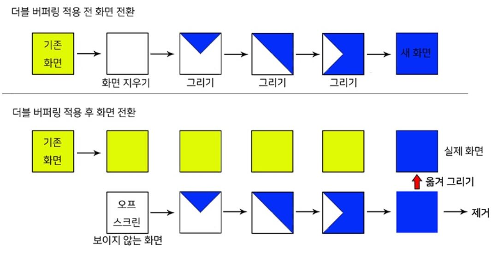

## :musical_score: How To Make Java Rhythm Game

> <a href="https://www.youtube.com/playlist?list=PLRx0vPvlEmdDySO3wDqMYGKMVH4Qa4QhR" >자바(JAVA) 리듬게임 만들기 강좌</a>


#### ✌ 더블버퍼링

> [Double Buffering - 더블 버퍼링 기법](https://movefast.tistory.com/6)

- 이미지가 전환될 때 깜빡이는 현상없이 부드럽게 전환하기 위해 사용되는 기법

  
  
- 소스코드    

  ```java
  public class DynamicBeat extends JFrame {
  
  	private Image screenImage;
  	private Graphics screenGraphic;
  	
  	private Image background;
  	
  	public DynamicBeat() {
  		... 
          // 프로그램이 시작될 때 버튼, 메뉴바 등 컴포넌트를 생성 후 add
          add(component); 
  	}
  	
  	public void paint(Graphics g) {
  		// 버퍼링용 이미지 생성
          screenImage = createImage(Main.SCREEN_WIDTH, Main.SCREEN_HEIGHT); 
  		screenGraphic = screenImage.getGraphics();
  		screenDraw(screenGraphic);
          // 실제화면으로 screenImage에 그려진 이미지를 옮김.
  		g.drawImage(screenImage, 0, 0, null); 
  	}
  	
  	public void screenDraw(Graphics g) {
          // 배경 이미지를 그림
  		g.drawImage(background, 0, 0, null); 
          // 버튼, 메뉴바 등 컴포넌트를 그림
          paintComponents(g); 
  		this.repaint();
  	}
  
  }
  
  ```

  

#### 💽 JLayer

- 게임에서 음악을 실행하기 위해서는 자바 라이브러리가 필요함
- <a href="javazoom.net">javazoom.net</a>에서 제공하는 JLayer를 사용

- JLayer 다운로드 후 프로젝트의 Java Build Path의 Libraries에 `jl1.0.1.jar` 추가

- JLayer 라이브러리를 통해 Player 클래스를 사용가능

  ```java
  import javazoom.jl.player.Player;
  
  File file = new File("../music/intro_music.mp3");
  FileInputStream fis = new FileInputStream(file);
  BufferedInputStream bis = new BufferedInputStream(fis);
  
  Player player = new Player(bis);
  
  player.play();
  player.close();
  
  int time = player.getPosition(); // 현재 음악이 재생되는 위치
  ```


#### 🎨 JFrame

- setUndecorated(true) : 윈도우 메뉴바 안보이게

- setLocationRelativeTo(null) : 창이 화면 정중앙에 뜨도록

- setDefaultCloseOperation(JFrame.EXIT_ON_CLOSE) : 창을 껐을 때 게임이 종료되도록

- Component

  - JLabel, JButton 등

  - component.setBounds(x, y, width, height) : 컴포넌트 위치 및 크기

  - component.addMouseListener() : 마우스 이벤트 등록

    ```java
    exitButton.addMouseListener(new MouseAdapter() {
        @Override
        public void mouseEntered(MouseEvent e) {
            ... // 버튼에 마우스 올렸을 때
        }
        @Override
        public void mouseExited(MouseEvent e) {
            ... // 버튼에서 마우스가 벗어났을 때
        }
        @Override
        public void mousePressed(MouseEvent e) {
            ... // 마우스가 버튼 클릭했을 때
        }
    });
    ```

  - component.addMouseMotionListener() : 마우스 모션 이벤트 등록

    ```java
    menuBar.addMouseMotionListener(new MouseMotionAdapter() {
        @Override
        public void mouseDragged(MouseEvent e) {
            ... // 메뉴바를 드래그했을 때
        }
    });
    ```

